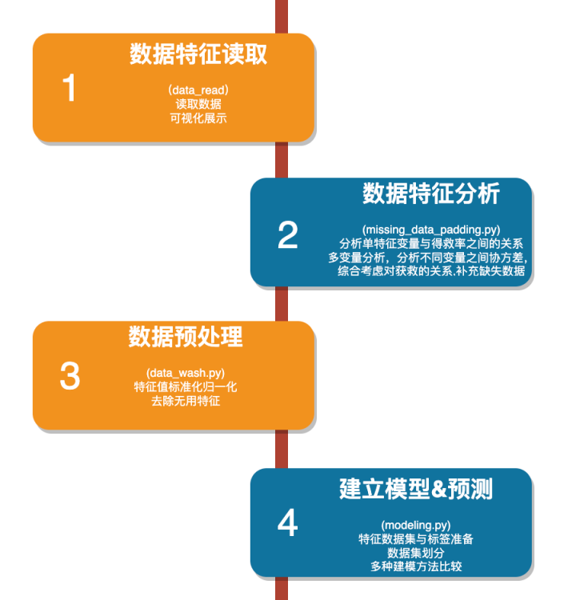

# Titanic_Passenger_Survival_Rate_Prediction
 This is a finial project for introduction to artificial intelligence 2023 summer course in SheZhen Technology university on predicting 
 the survival rate of the Titanic's  passengers
## Requirements

* Python 3.8
* numpy 1.26.2
* pandas  2.1.3
* matplotlib 3.8.2
* seaborn 0.13.0
* scikit-learn 1.1.3
# Project construction

this picture show you the construction of this project
## Introduction
The sinking of the Titanic is one of the most infamous maritime disasters in history. On April 15, 1912, the Titanic struck an iceberg and sank in the North Atlantic Ocean, killing over 1,500 passengers and crew members.

The sinking of the Titanic has been the subject of much research and speculation. One area of interest is the factors that contributed to the survival of passengers. In this project, we will use artificial intelligence to predict the survival rate of Titanic passengers.

## Data and Methods

This Project used a dataset of Titanic passenger information from Kaggle. The dataset includes information on passengers' age, sex, class, fare, and survival status.

This Project used seven AI algorithms to predict the survival rate of Titanic passengers: 
* Radial Support Vector Machines(rbf-SVM)
* Linear Support Vector Machine(linear-SVM)
* Logistic Regression
* Decision Tree
* Random Forest
* K-Nearest Neighbours(KNN)
* Naive Bayes
## Data Preprocessing
We performed the following data preprocessing steps:

Missing value imputation: We imputed missing values for continuous variables using the mean value and for categorical variables using the mode value.

Feature standardization: We standardized the continuous variables to have a mean of 0 and a standard deviation of 1.

Feature selection: We used a combination of statistical tests and domain knowledge to select the most important features.

Feature correlation analysis: We analyzed the correlation between features to identify any potential multicollinearity issues.
## Results

The results of our experiments showed that all seven algorithms are able to predict the survival rate of Titanic passengers with a high degree of accuracy. The Radial SVM algorithm had the highest accuracy, followed by the KNN algorithm and the logistic regression algorithm.

